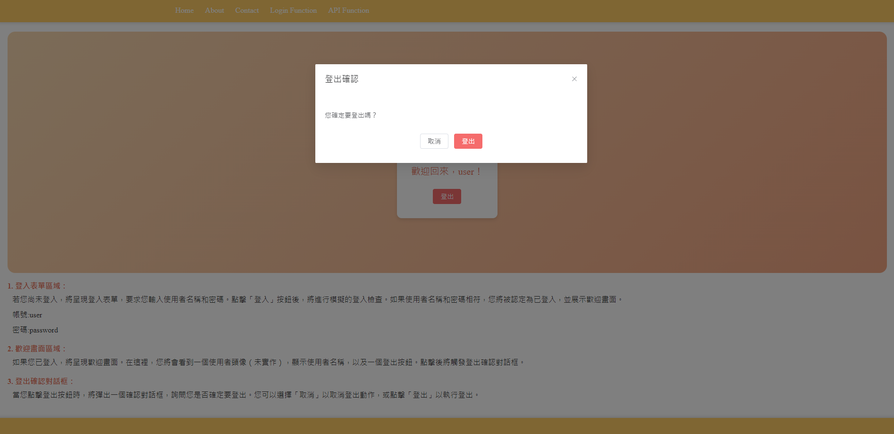

# vue-cli

## Project setup
```
npm install
```

### Compiles and hot-reloads for development
```
npm run serve
```

### Compiles and minifies for production
```
npm run build
```

### Lints and fixes files
```
npm run lint
```

### Customize configuration
See [Configuration Reference](https://cli.vuejs.org/config/).


### Api Function (view)
#### client-api-get

client-api-get-success


### Login Function (view)
#### login

#### login-success

#### logout


### Home (view)
#### website-home


### About (view)
#### website-about


### Form (view)
#### website-form

